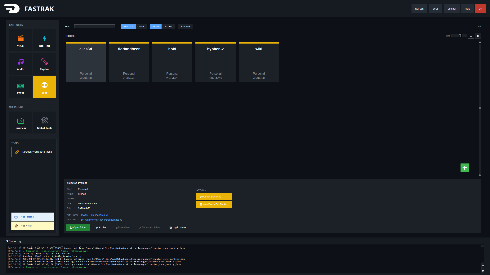

# Pipeline-Manager

A professional pipeline management system for creative and business workflows with GUI.

## Overview

The Pipeline-Manager is a toolkit designed to streamline various creative and business processes. It provides an intuitive interface for managing projects across multiple domains including audio production, visual design, web development, photography, and business operations.

### Key Features

- **Professional GUI Interface** - Dark-themed interface built with tkinter
- **Multi-Domain Support** - Handles audio, visual, web, photography, and business workflows
- **Automated Folder Structures** - Create standardized project folders for each domain
- **Backup & Sync Tools** - Automated backup and synchronization utilities
- **Extensible Architecture** - Modular design for easy additions and customizations

## Screenshots


## Requirements

### System Requirements
- **Python**: 3.8 or higher
- **Operating System**: Windows, macOS, or Linux
- **Dependencies**: See `requirements.txt`

### Python Dependencies
- `pillow>=10.0.0` - Image processing and logo display
- `pyexiv2>=2.8.0` - EXIF metadata handling for images
- `setuptools<81` - Required by invoice2data (Python 3.13+ removed `pkg_resources`)
- `pdfplumber>=0.9.0` - PDF text extraction for invoice processing
- `invoice2data>=0.4.0` - Template-based invoice data extraction
- `tkinter` - GUI framework (included with Python)

### External Software Dependencies

Some pipeline scripts require additional external software:

#### Audio Production Scripts
- **FFmpeg** - Required for audio conversion and format handling
  - Windows: Download from [ffmpeg.org](https://ffmpeg.org/download.html)
  - macOS: `brew install ffmpeg`
  - Linux: `apt-get install ffmpeg` or equivalent

- **FLAC Tools (flac-1.5.0-win or later)** - Required for FLAC metadata operations
  - Used by: Sync iTunes Playlists to DJ Library (for writing playlist metadata to FLAC comment fields)
  - Windows: Download from [xiph.org FLAC downloads](https://xiph.org/flac/download.html)
  - macOS: `brew install flac`
  - Linux: `apt-get install flac` or equivalent
  - Note: The `metaflac` command-line tool must be in your system PATH

#### Cloud Sync Tools
- **rclone** - Required for cloud storage synchronization (OneDrive, Google Drive, etc.)
  - Used by: Backup MusicBee to OneDrive
  - Download from [rclone.org](https://rclone.org/downloads/)
  - After downloading, extract `rclone.exe` to the `tools/rclone/` folder in this repository
  - Configure your remote: `rclone config` (follow the interactive setup for your cloud provider)
  - Note: The `tools/` folder is gitignored - you must download rclone separately

## Installation

### Prerequisites (one-time, ~2 minutes)

You need **Python** and **git** on the machine before `install.py` can run. Open Command Prompt — press **Start**, type **`cmd`**, press Enter — then:

1. Type **`python`**. Windows opens the Microsoft Store on the Python page; click **Get**.
2. Type **`winget install Git.Git -e`** to install git.
   *If you get "winget is not recognized"*: install **App Installer** from the Microsoft Store first, then retry.
3. Close the window and open a fresh `cmd` so the new tools land on PATH.

Then continue with the one-command install below.

### One command (recommended)

```bash
git clone https://github.com/floriandheer/FastRak.git
cd FastRak
python install.py
```

`install.py` is a friendly first-run installer that walks you through seven steps:

1. **Prerequisites check** — verifies Python, pip, and git are present (install them via the section above if not)
2. **Python packages** — `pip install -r requirements.txt`
3. **External tools** — FFmpeg, FLAC, rclone (offers a winget install on Windows)
4. **Environment** — folders, `subst` drive mappings (with registry persistence, no admin needed), Synology checks, pipeline config
5. **Workstation apps** — KeePassXC, Synology Drive, browser, media player, and role-specific picks (Visual / Audio / RealTime / ...)
6. **Desktop shortcut** — generates `Fastrak.lnk` you can pin to the taskbar
7. **Doctor** — verifies the end state is healthy

Every step asks before touching anything. Safe to re-run on the same machine, and gives a clean "all green" report when done.

```bash
python install.py --yes            # accept every prompt (CI / unattended)
python install.py --dry-run        # show what would happen, change nothing
python install.py --step deps      # run a single step
python install.py --skip-externals # skip FFmpeg/FLAC/rclone checks
```

### Manual / piecemeal install

If you'd rather drive it yourself, the building blocks are still available:

```bash
python install_dependencies.py             # just the Python packages
copy setup_config.json.example setup_config.json
# ...edit setup_config.json...
python setup_environment.py                # folders + drives + config
python make_shortcut.py                    # Fastrak.lnk
```

See [docs/INSTALLATION.md](docs/INSTALLATION.md) for the full walkthrough.

## Usage

### Launching the Pipeline Manager

**Method 1: Python script**
```bash
python fastrak_hub.py
```

**Method 2: Pinned Windows shortcut (recommended)**

A `Fastrak.lnk` shortcut launches the hub through `pythonw.exe` (no console window) and can be pinned to the taskbar/Start menu like a native app. The running window groups under the same taskbar slot as the pinned icon thanks to the `AppUserModelID` set inside `fastrak_hub.py`.

### Creating the Windows Shortcut

#### Option A — Generated (recommended)

Run the helper script from the repo root:

```bash
python make_shortcut.py
```

This produces `Fastrak.lnk` next to the script, with paths resolved relative to wherever the repo is cloned (no hardcoded drive letters). You can also trigger it from Pipeline Manager > Settings > **Create Shortcut**. Then:

1. Right-click `Fastrak.lnk` → **Pin to taskbar** or **Pin to Start**
2. (Optional) Copy the `.lnk` to your Desktop for a desktop icon

#### Option B — Manual setup

If you'd rather configure it by hand (or the helper failed):

1. Right-click on the desktop → **New** → **Shortcut**
2. **Location**: enter the full target with arguments, e.g.
   ```
   "C:\Path\To\Python\pythonw.exe" "C:\Path\To\floriandheer\fastrak_hub.py"
   ```
   - Use `pythonw.exe` (not `python.exe`) so no console window appears
   - Quote both paths if they contain spaces
3. **Name** the shortcut `Fastrak` and finish
4. Right-click the new shortcut → **Properties**
   - **Start in**: set to the repo folder (e.g. `C:\Path\To\floriandheer`)
   - **Change Icon...** → browse to `assets\Favicon_FlorianDheer.ico` in the repo
5. Click **OK**, then right-click → **Pin to taskbar**

The icon and AppUserModelID are already wired up inside `fastrak_hub.py`, so the running window will inherit the icon and merge with the pinned shortcut on the taskbar.

### Keyboard Shortcuts

The Pipeline Manager features a comprehensive keyboard navigation system designed for efficiency. Press **F1** or click the **Help** button to view all shortcuts.

**Quick Reference:**
| Keys | Action |
|------|--------|
| **1/2/3** | Scope: Personal / Work / All |
| **4/5/6** | Status: Active / Archive / All |
| **W/S** | Navigate between panels |
| **A/D** | Switch left panel ↔ Project Tracker |
| **Arrows** | Navigate within current panel |
| **Shift+Letter** | Quick select category (V/R/A/P/H/W/B/G) |
| **Ctrl+N** | Create new project |
| **G** | Open category folder |
| **N** | Open category notes |
| **Ctrl+F** or **/** | Focus search |
| **F1** | Open keyboard shortcuts documentation |

For the complete shortcut reference and design philosophy, see **[SHORTCUTS.md](SHORTCUTS.md)**.

### Available Pipeline Scripts

The Pipeline Manager includes 14+ specialized scripts organized by category:

#### 🎵 Audio Production
- **New DJ Project** - Create standardized DJ project structure
- **Backup MusicBee to OneDrive** - Incremental backup of MusicBee library
- **Sync iTunes Playlists to DJ Library** - Synchronize playlists with WAV conversion

#### 📸 Photography
- **New Photo Project** - Create standardized photography project folders

#### 🎨 Visual Design
- **New CG Project** - Computer graphics project structure
- **New GD Project** - Graphic design project structure
- [**Add Text to Image Metadata**](README_ADD_TEXT_TO_IMAGE_METADATA.md) - Embed text descriptions in image EXIF data

#### 🌐 Web Development
- **New Web Project** - Standardized web development structure
- [**Laragon Workspace Manager**](README_LARAGON_WORKSPACE_MANAGER.md) - Manage Laragon project junctions to work drive
- [**Publish Static Site**](README_STATIC_SITE_PUBLISHER.md) - Upload Staatic exports to FTP, sync DokuWiki, and create dated archives
- [**WordPress Dev Backup**](README_WORDPRESS_DEV_BACKUP.md) - Backup/restore WordPress dev sites (files + DB) and Laragon environment

#### 🖨️ 3D Printing
- **New 3D Printing Project** - Organize 3D printing files and iterations
- [**WooCommerce Order Monitor**](README_ORDER_MONITOR.md) - Monitor WooCommerce orders and organize folders with packing slips, labels, invoices and details

#### 📊 Business & Bookkeeping
- **Create Bookkeeping Folder Structure** - Financial organization structure
- **Invoice Renamer** - Automatically rename and organize invoices
- **Invoice Checker** - Quarterly & yearly invoice verification with duplicate detection, naming validation, and auto-rename using [invoice2data](https://github.com/invoice-x/invoice2data) templates

#### 🔧 Global Utilities
- **Cleanup Tool** - System-wide cleanup and maintenance utilities


## Configuration

### Customizing Base Paths

Edit the category definitions in `fastrak_hub.py` to customize base folder paths:

```python
CREATIVE_CATEGORIES = {
    "AUDIO": {
        "folder_path": "I:\\Audio",  # Change to your audio base path
        # ...
    },
    # ...
}
```

### Adding Custom Scripts

1. Create your script in the `modules/` directory
2. Follow the naming convention: `PipelineScript_Category_Name.py`
3. Add the script reference in `fastrak_hub.py` under the appropriate category

## Troubleshooting

### Common Issues

**Issue: "Module not found" errors**
- Solution: Run `python install_dependencies.py` to install missing dependencies

**Issue: pyexiv2 installation fails**
- Solution: pyexiv2 requires system libraries. On Linux: `sudo apt-get install libexiv2-dev`
- On Windows: Download pre-built wheels from PyPI

**Issue: Scripts don't launch**
- Solution: Verify script paths in the main configuration match your system
- Check that base folder paths exist or script can create them


## Contributing

This is a personal pipeline management system, but suggestions and improvements are welcome!


## Author

**Florian Dheer**

For questions or support, please refer to the inline documentation or contact the author.
email: info@floriandheer.com
